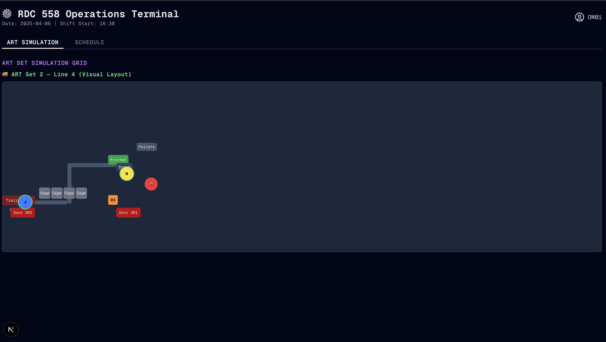
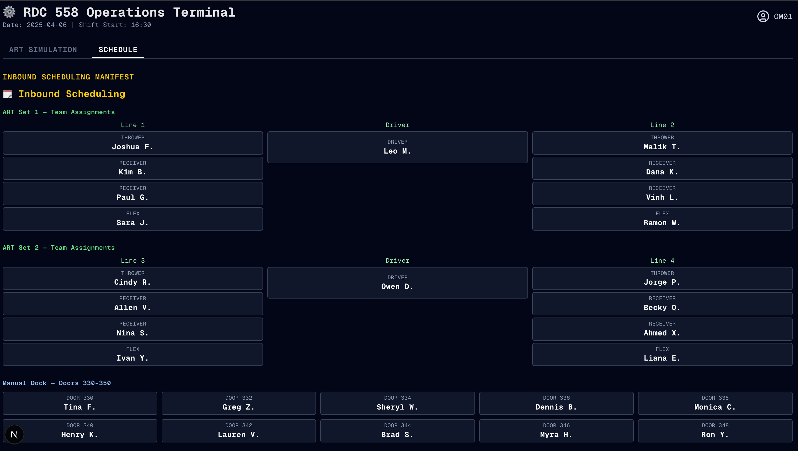

# RDC 558 — Inbound Operations Tracker

This is a project to make my job easier and simulate warehouse operations visually. The goal is to reduce quality errors and understand how to work with people better. By visualizing the ART (Automated Receiving Terminal) layout and tracking every box in motion, I can learn how to be a more effective operational lead.

---

## 🛠️ Getting Started

Run the development server:

```bash
npm run dev

Then open [http://localhost:3000](http://localhost:3000) in your browser.


---

## 🎯 Purpose

This tool provides a **real-time simulation** of:

- 📦 Box movement through ART lines (throw → scan → receive → stage)
- 👥 Worker roles: thrower, receiver, driver
- 🚚 Trailer + Conveyor layout by ART set and line
- 🗓️ Inbound scheduling and team assignments

The simulation helps visualize:

- Where a box is in real-time
- Who is throwing, receiving, and staging each box
- Where workers are placed
- How to reduce carton errors and optimize throughput

### 🤖 Future goals:
- Integrate video feed + camera tracking
- Match visual input to real cartons for error detection
- Add box heatmaps and alerts
- Assign optimal crew based on team history, productivity, and fatigue

---

## 📷 Screenshots

### 1. **ART Floor Blueprint Layout (Figma Spec)**


### 2. **Live Simulation View**


### 3. **Schedule View**


---

## 📚 Learn More

To learn more about the tech powering this:
- [Next.js Documentation](https://nextjs.org/docs)
- [Learn Next.js](https://nextjs.org/learn)
- [Framer Motion](https://www.framer.com/motion/) — used for smooth simulation animation
- [TailwindCSS](https://tailwindcss.com/) — UI styling

---

## 🚀 Deployment

Deploy using the [Vercel Platform](https://vercel.com/new?utm_medium=default-template&filter=next.js&utm_source=create-next-app&utm_campaign=create-next-app-readme).

More deployment options: [Next.js deployment docs](https://nextjs.org/docs/app/building-your-application/deploying)

---

## 💡 Vision

Imagine every carton tracked — every person accounted for — every error seen before it happens.

This is just the beginning.

🧠
